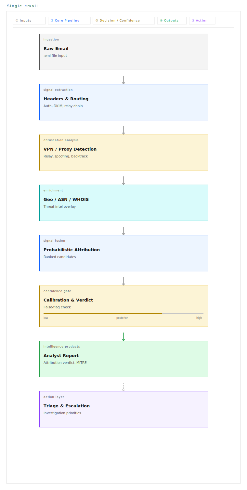
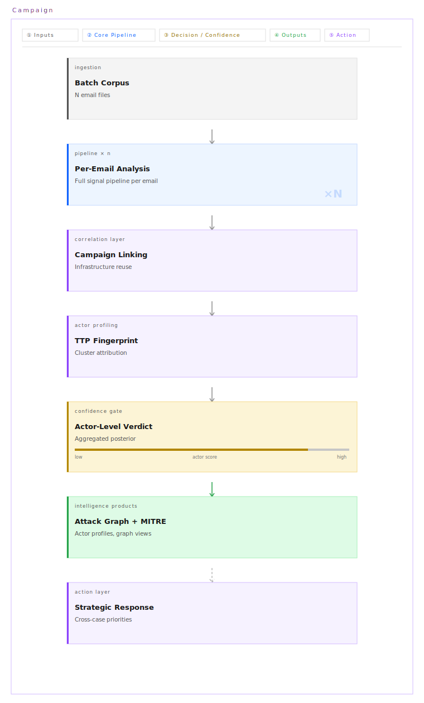

# HunterTrace: Explainable Email Routing and Attribution System

HunterTrace is a forensic pipeline for analyzing `.eml` messages, reconstructing routing paths, extracting attribution signals, and producing explainable attribution results for suspicious email traffic. It combines hop parsing, authentication validation, enrichment, provenance-aware signal handling, semantic checks, correlation logic, and deterministic scoring so analysts can see both the conclusion and the evidence behind it.

The project addresses a common DFIR problem: email evidence is noisy, partially attacker-controlled, and often routed through relays, webmail services, VPNs, or forwarding chains. HunterTrace helps turn that messy evidence into a structured analysis with traceable reasoning, confidence controls, and explicit abstention when the evidence is weak or contradictory.

## Key Features

- Hop-chain reconstruction from `Received` headers with IPv4 and IPv6 support.
- Signal extraction and normalization from routing, timing, identity, and authentication fields.
- Geo/IP enrichment for IP ownership, ASN, hosting, and geolocation context.
- DKIM cryptographic verification with signed-header and failure detail reporting.
- SPF validation and alignment checks.
- DMARC evaluation using SPF and DKIM outcomes.
- ARC chain validation for forwarded and relayed email handling.
- Provenance-aware signal modeling via `huntertrace.atlas.provenance`.
- Received-chain semantic validation and anomaly scoring.
- Correlation-driven anonymization and contradiction detection.
- Deterministic scoring with confidence caps, abstention rules, and calibration hooks.
- Explainability that links signals back to hops, headers, and provenance class.
- Adversarial testing and deterministic failure simulation for robustness evaluation.
- Campaign correlation, actor profiling, attack graph generation, and MITRE ATT&CK layer export in v3 mode.

## Architecture

High-level flow:

`.eml` -> parsing -> hops -> signals -> normalization -> enrichment -> provenance -> semantic validation -> correlation -> scoring -> calibration -> explainability -> output

HunterTrace currently has two analysis layers:

- `huntertrace.core.pipeline.CompletePipeline` handles single-message and batch email analysis, including header parsing, authentication checks, enrichment, threat analysis, real-IP extraction, and stage-rich reporting.
- `huntertrace.core.orchestrator.HunterTraceV3` adds campaign correlation, actor profiling, graph building, Bayesian actor attribution, and MITRE ATT&CK output across multiple emails or previously saved JSON reports.

The current single-email pipeline diagram is preserved below:

### Single Email Pipeline Diagram

<p align="center">
  
</p>

Source: `assets/design/huntertrace-single-email-container.svg`

## How It Works (Step-by-Step)

1. **Parse the email**
   HunterTrace reads the raw `.eml`, extracts core headers, and rebuilds the `Received` chain in chronological order.

2. **Reconstruct hops**
   Each hop is parsed for IPs, hostnames, protocol, timestamps, and transport clues such as TLS markers.

3. **Validate authentication**
   The pipeline evaluates SPF, DKIM, DMARC, and ARC to determine whether sender claims and forwarding context are trustworthy.

4. **Extract signals**
   Routing, timing, authentication, and message metadata are converted into normalized signals for downstream analysis.

5. **Assign provenance**
   Each signal is labeled by origin, such as sender-controlled, relay-generated, recipient-generated, or cryptographic.

6. **Run semantic validation**
   The system checks for malformed values, suspicious timezone artifacts, missing authentication, excessive hops, and inconsistent chain structure.

7. **Classify and enrich infrastructure**
   IPs are classified and enriched with ownership, hosting, ASN, and geolocation data where available.

8. **Correlate evidence**
   Correlation logic looks for anonymization patterns, contradictions, relay inconsistencies, and supporting agreement across signal groups.

9. **Score and calibrate**
   A deterministic inference engine scores candidate regions, applies evidence penalties and abstention rules, and supports isotonic calibration for better confidence behavior.

10. **Explain the result**
   The final report keeps the winning and rejected signals, anomalies, confidence breakdown, and trace data needed for review.

11. **Scale to campaigns**
   In v3 mode, multiple email results are correlated into actor clusters, profiles, graphs, and MITRE ATT&CK layers.

## Installation

### Basic install

```bash
python3 -m venv .venv
source .venv/bin/activate
pip install -U pip
pip install -e .
```

### Install with optional extras

```bash
pip install -e .[all]
```

Optional extras in `pyproject.toml` include:

- `graph` for graph tooling
- `whois` for WHOIS enrichment
- `dev` for test and formatting tools

Python `3.8+` is required.

## Usage

### CLI entry points

The packaged CLI entry point is `huntertrace`. There is currently no `python -m huntertrace` wrapper in the package, so use one of the commands below or `python -m huntertrace.cli`.

### Single email

```bash
huntertrace analyze path/to/message.eml
```

Verbose mode:

The HunterTrace pipeline is modeled in two complementary views:

- **Single Email Pipeline**: end-to-end analysis for one `.eml` sample
- **Campaign Intelligence Pipeline**: cross-email correlation and actor-level attribution

### Single Email Pipeline


Source: [assets/design/huntertrace-single-email-container.svg](assets/design/huntertrace-single-email-container.svg)

### Campaign Intelligence Pipeline



Source: [assets/design/huntertrace-campaign-container.svg](assets/design/huntertrace-campaign-container.svg)


## Quick Start

### Installation
```bash
huntertrace analyze path/to/message.eml -v
```

Equivalent module-style invocation:

```bash
python -m huntertrace.cli analyze path/to/message.eml -v
```

### Example CLI output

```text
huntertrace analyze path/to/message.eml

  HUNTERTRACE vX.Y.Z
[START] Complete Attacker IP Identification Pipeline

[STAGE 1] Extracting email headers...
[SUCCESS] Found <N> hops in email chain
[INFO] Unique IPs found: <ip_1>, <ip_2>, <ip_3>
  [AUTH] DKIM present: <yes|no> | valid: <yes|no>
    Domain/selector: <domain> / <selector>
    Failure reason: <reason_if_any>

[EMAIL AUTHENTICATION]
  Verdict: <CLEAN|SUSPICIOUS|MALICIOUS>
  SPF: <PASS|FAIL|NONE> | Aligned (relaxed): <True|False>
  DKIM: <VALID|INVALID|NONE>
  DMARC: <PASS|FAIL|NONE>
  ARC: <VALID|INVALID|NONE>
  [WEBMAIL] <webmail leak summary>

[PHASE 0] Profiling attacker techniques...
  Risk: <LOW|MEDIUM|HIGH> (<score%>)
  Header integrity: <percent%>
  Header semantics: <percent%>
  Semantic anomalies: <comma-separated list or none>

[STAGE 2] Classifying IPs...
  <ip_1>: <classification> (confidence: <%>, threat: <score>/100)
  <ip_2>: <classification> (confidence: <%>, threat: <score>/100)

[STAGE 3A] Analyzing proxy chain...
  Obfuscation layers detected: <count>
  Real origin status: <ip_or_status>

[STAGE 3B] Enriching with WHOIS/DNS data...
  <ip_1>: <owner_or_asn>
  <ip_2>: <owner_or_asn>

[STAGE 3C] Analyzing infrastructure correlation...
  Clusters detected: <count>
  Patterns found: <count>
  Est. infrastructure size: <count> IPs
  Est. team size: <range>

[STAGE 4] Aggregating threat intelligence...
  Overall threat assessment: <LOW|MEDIUM|HIGH>

[REAL IP EXTRACTION] Identifying true attacker IP (VPN/Proxy bypass)...
  Using ADVANCED Real IP Extractor (...)
  [+] EXTRACTED ATTACKER IP: <ip> (<confidence%> confidence)

[GEOLOCATION] Enriching attacker IP location...
  Using real IP extraction result: <ip>

[ATTRIBUTION] Running Bayesian multi-signal attribution (Layer 5)...
  Primary region : <region>
  Confidence     : <%> (ACI-adjusted: <%>)
  ACI score      : <score>
  Tier           : <tier> - <label>
  Reliability    : <reliability_mode>
  Signals used   : <signal_1>, <signal_2>, <signal_3>
  Top candidates :
    <region_a>                       <%>
    <region_b>                       <%>
    <region_c>                       <%>

[STAGE COMPLETE] All stages finished successfully
Analysis complete
```

### Dataset / bulk processing

```bash
huntertrace batch path/to/eml_dir
```

### Campaign correlation

```bash
huntertrace campaign path/to/eml_dir -o ./v3_output
```

For offline correlation from saved JSON reports:

```bash
python huntertrace/core/orchestrator.py offline ./json_reports -o ./v3_output
```

### Export JSON

`huntertrace analyze` currently runs the pipeline and prints stage output, but it does not persist a JSON file by itself. To export the stage-rich JSON report from the current pipeline, use the Python API:

```python
from huntertrace.core.pipeline import CompletePipeline, CompletePipelineReport

pipeline = CompletePipeline(verbose=False)
result = pipeline.run("sample.eml")

if result:
    report = CompletePipelineReport(result)
    payload = report.to_json()
```

### Deterministic attribution report runner

For the newer compact attribution report format based on normalized signals, use the attribution report utilities in `huntertrace.attribution.report`.

### Simulate failures / adversarial tests

Run deterministic adversarial scoring tests:

```bash
python -m huntertrace.attribution.adversarial_testing
```

Run deterministic evaluation:

```bash
python -m huntertrace.attribution.evaluation
```

Run active-analysis validation and adversarial validation cases:

```bash
python -m huntertrace.active.activeValidation --help
```

## Output Format

HunterTrace currently exposes two main output shapes:

- A **stage-rich pipeline report** from `CompletePipelineReport.to_json()`
- A **compact attribution report** from `huntertrace.attribution.report`

The compact attribution report is the best summary format for downstream review:

```json
{
  "result": {
    "region": "Region-X",
    "confidence": 0.62,
    "verdict": "attributed",
    "signals_used": [],
    "signals_rejected": [],
    "anomalies": [],
    "limitations": [],
    "authentication": {},
    "confidence_breakdown": {},
    "explanation": "..."
  },
  "trace": {
    "evidence_id": "...",
    "source": "...",
    "signal_count": 0,
    "candidate_count": 0,
    "winner": "Region-X",
    "verdict": "attributed",
    "abstention_reasons": [],
    "correlation": {},
    "authentication": {}
  }
}
```

Important fields:

- `region`: the selected candidate region, or `null` when inconclusive
- `confidence`: final calibrated or bounded confidence score
- `verdict`: `attributed` or `inconclusive`
- `signals_used`: supporting and conflicting signal contributions that affected scoring
- `signals_rejected`: signals excluded or treated as non-attributable
- `explanation`: concise natural-language summary of why the result was produced
- `trace`: candidate-level evidence, abstention reasons, and correlation details

The stage-rich pipeline report additionally includes parsed hops, classifications, enrichment, threat intelligence, geolocation, real-IP analysis, and stage-level attribution summaries.

## Performance

Evaluated on a labeled corpus of 53 phishing emails with known ground-truth origins:

| Method | Top-1 Country Accuracy | Notes |
|--------|------------------------|-------|
| IP Geolocation Only | ~31% | Industry baseline |
| Timezone Only | ~52% | VPN-resistant, coarse |
| **HUNTERTRACE (Bayesian)** | **52.8%** | Multi-signal fusion |
| **HUNTERTRACE (+ Graph)** | **56.6%** | Region-level accuracy |

**95% Confidence Interval**: 39.7% – 65.6% (n=53)  
**Webmail IP Leak Rate**: 37.7% of analyzed emails  
**Coverage**: 100% (no failed predictions)

> ⚠️ **Note**: Performance numbers are based on an initial corpus of 53 labeled
> emails. Larger-scale validation is in progress. Region-level accuracy (56.6%)
> is more reliable than country-level given current corpus size.

## Evaluation

HunterTrace includes several evaluation layers in the current codebase:

- **Dataset testing** in `huntertrace.attribution.evaluation` for deterministic scenario-based measurement.
- **Adversarial testing** in `huntertrace.attribution.adversarial_testing` for spoofed infrastructure, mixed signals, noise injection, signal removal, and temporal evasion.
- **Comparative evaluation** in `huntertrace.attribution.comparative_evaluation` for measuring the effect of correlation-aware scoring.
- **Active validation** in `huntertrace.active.activeValidation` for validating optional active-analysis techniques and adversarial resilience.
- **Determinism checks** in demo and evaluation flows to ensure repeated runs yield stable outputs for the same inputs.

The codebase is explicit about abstention. A low-confidence or contradictory case should end as `inconclusive` rather than becoming a false attribution.

## Limitations

- HunterTrace cannot fully deanonymize a sender behind strong VPN, proxy, Tor, or privacy-preserving relays if the email does not leak usable evidence.
- Results depend on header integrity. If `Received` chains are forged, truncated, or heavily rewritten, attribution quality drops.
- DNS-dependent checks such as DKIM, SPF, DMARC, ARC, and some enrichment paths depend on resolver access and current DNS state.
- Geolocation and ownership signals are contextual, not ground truth.
- Some CLI paths are not yet unified. The packaged CLI, pipeline script entry points, and v3/orchestration flows expose overlapping but not identical capabilities.

## Recent Updates

- Added **Atlas provenance integration** to classify signals by trust origin such as sender-controlled, relay-generated, recipient-generated, and cryptographic.
- Added a **unified deterministic scoring/report path** in `huntertrace.attribution.report` on top of normalized signals and correlation-aware inference.
- Added **semantic received-chain validation** and structure-aware anomaly handling.
- Expanded **authentication handling** with DKIM verification, SPF alignment, DMARC evaluation, and ARC validation.
- Added **confidence breakdown and calibration hooks**, including isotonic calibration support in `huntertrace.attribution.calibration`.
- Added **failure simulation and adversarial testing** for scoring robustness.
- Added **v3 orchestration** for campaign correlation, actor profiling, attack graph generation, and MITRE ATT&CK layer export.
- Continued to retain older single-email pipeline modules while shifting newer explainability and scoring behavior into dedicated attribution and provenance modules.

## Project Structure

```text
HunterTrace/
├── huntertrace/
│   ├── atlas/                 # provenance and audit helpers
│   ├── attribution/           # authentication, scoring, calibration, evaluation, reports
│   ├── analysis/              # correlation, campaign, sender and actor profiling
│   ├── core/                  # main pipeline, orchestrator, ingestion models
│   ├── enrichment/            # IP classification, hosting, geolocation, databases
│   ├── extraction/            # email parsing, webmail leakage, real-IP extraction, backtracking
│   ├── forensics/             # scanners, canary tokens, attacker technique profiling
│   ├── graph/                 # graph building, centrality, correlation support
│   ├── active/                # optional active-analysis and validation modules
│   └── utils/                 # dataset helpers and support code
├── config/                    # scoring configuration
├── demo/                      # demo datasets and enterprise demo outputs
├── evaluation/                # evaluation runners and corpus tooling
├── examples/                  # usage examples
├── scripts/                   # demo and helper scripts
├── requirements.txt
├── pyproject.toml
└── README.md
```

## Contributing

Contributions should keep the pipeline deterministic, explainable, and auditable.

Recommended workflow:

1. Create a branch for the change.
2. Keep changes scoped to one subsystem where possible.
3. Add or update tests for scoring, provenance, validation, or CLI behavior when those paths change.
4. Prefer changes that preserve explainability and abstention safety over aggressive attribution.
5. Run the relevant evaluation or adversarial modules when modifying scoring logic.

## Citation

```bibtex
@software{huntertrace2026,
  author = {[Your Name]},
  title = {HUNTERTRACE: Multi-Signal Phishing Attribution},
  year = {2026},
  url = {https://github.com/akshaydotweb/HunterTrace}
}
```

If you change scoring, provenance, or validation behavior, update the documentation and example outputs at the same time.

## License

MIT License. See `LICENSE`.
